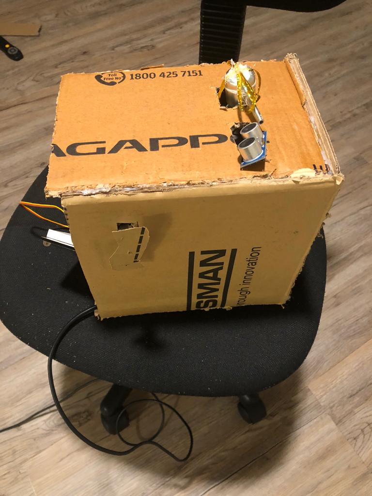
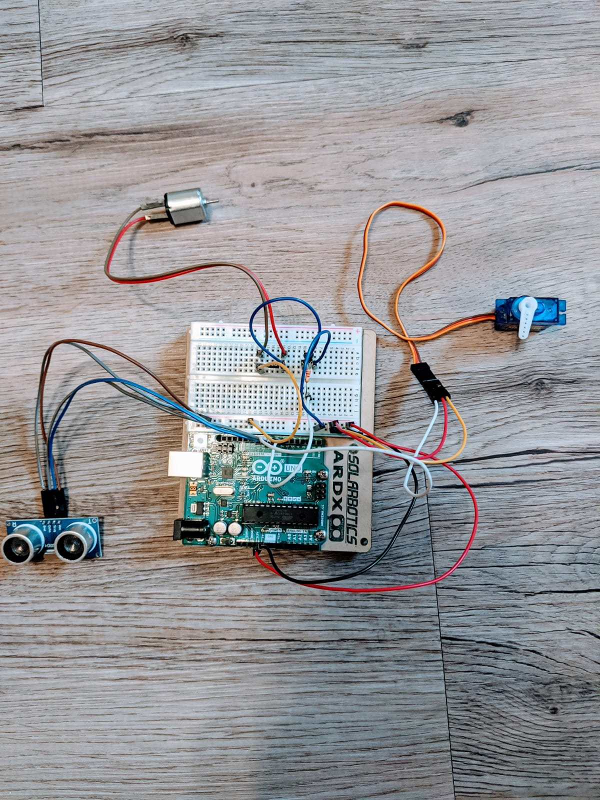

# CS-207-Project-
Group project ( Preet, Nisarg, Manan)

# Introduction,

The project undertaken for this term was an automatic water dispensing machine. This
was done so that people can easily get water and need not to turn on the taps. In this way it is
very hygienic as the taps have germs on it. If this type of machine is applied in public places
such as hospitals, schools it could prevent many diseases. This is comparatively very cheap as
this type of machine can be setup in less than $ 30. The structure of the dispensing machine is the
simple carboard structure where you put a glass and the water comes out from it. A simple
modification which is done by me in this, as when the temperature is hot along with the water it
also dispenses ice cubes into the glass.
The basic concept of this is as the ultrasonic sensor detects the glass which is placed less
than 3 cm away from the sensor, it activates the relay which turn on the micro air pump, the
micro air pump creates the pressure inside the tube so the water comes out from another tube and
water falls in the glass. If the temperature is more than 26◦ C, which is detected by the
temperature sensor, the servo motor activates, which releases the flap and ice cubes drop in.

# materials used : 

Ultrasonic sensor 

DC motor 

Servo motor 

Transistor 

diode 

registor

Dispencing air pump

## Circuit diagram

## circuit assamble

## Final model 

## Designing Process,

The designing process of this structure of the dispensing machine is much
complex. Many square and rectangle shapes of the carboard pieces must be cut
down and must be assembled to be to form a structure of the dispensing machine.
In the middle of the cardboard there are 2 holes in which the two eyes of the
ultrasonic sensor will be seen. Behind the in the structure there is an area for the
tank. The tank will be in the form of a plastic bottle.
The main circuit is placed above the container which consists of Arduino
Uno, a servo motor, a DC motor and an ultrasonic sensor. The ultrasonic sensor
has 4 pins namely Vcc, ground, echo and trigo. The echo and trigo are connected
to Arduino to pins 9 and 10 respectively. The Vcc and the ground pin is connected
to the 5 volts and ground. The DC motor input is connected to Arduino via pin 7,
and the servo DATA input is connected to pin 8. Here the power and ground of the
servo motor is connected to 5V and ground. Here as the string attached to servo is
pulled due to the oscillatory motion then the soap comes out. The dryer fan is made
with the DC motor connected to the circuit. As here a delay is set to make the
make the fan run after 25 seconds from the soap dispensing as it is advised to was
hand for at least 20 seconds.

## refernces from youtube :

https://www.youtube.com/watch?v=jeJyLKhF3Xs&t=80s

